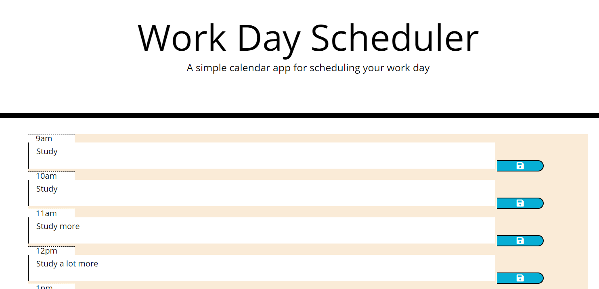

# to-do-working-schedule

## Description

This project is to create a working to-do list with functions that keep track in real-time.

- My motivation for this project was to practice the uses of third party APIs.
- I built this project to test using sources such as jQuery and moment.js.
- This problem solves utilizing extra tools to build websites and add them to my arsenal.
- I learned how to utilize third party APIs to further the complexity of a website.

## Usage

Usage is to set different plans for a schedule and save them at different dates.
!
    

## Credits

Credit is due to Lucs Rozon, Freddy Kwak, Tabitha Salmon, Juliana Lamond, and Sean Dillon, as they are all members of my study group.

## License

MIT License

Copyright (c) [2022] [Joshua Rae]

Permission is hereby granted, free of charge, to any person obtaining a copy
of this software and associated documentation files (the "Software"), to deal
in the Software without restriction, including without limitation the rights
to use, copy, modify, merge, publish, distribute, sublicense, and/or sell
copies of the Software, and to permit persons to whom the Software is
furnished to do so, subject to the following conditions:

The above copyright notice and this permission notice shall be included in all
copies or substantial portions of the Software.

THE SOFTWARE IS PROVIDED "AS IS", WITHOUT WARRANTY OF ANY KIND, EXPRESS OR
IMPLIED, INCLUDING BUT NOT LIMITED TO THE WARRANTIES OF MERCHANTABILITY,
FITNESS FOR A PARTICULAR PURPOSE AND NONINFRINGEMENT. IN NO EVENT SHALL THE
AUTHORS OR COPYRIGHT HOLDERS BE LIABLE FOR ANY CLAIM, DAMAGES OR OTHER
LIABILITY, WHETHER IN AN ACTION OF CONTRACT, TORT OR OTHERWISE, ARISING FROM,
OUT OF OR IN CONNECTION WITH THE SOFTWARE OR THE USE OR OTHER DEALINGS IN THE
SOFTWARE.

# Link

https://github.com/joshuar2155/to-do-working-schedule